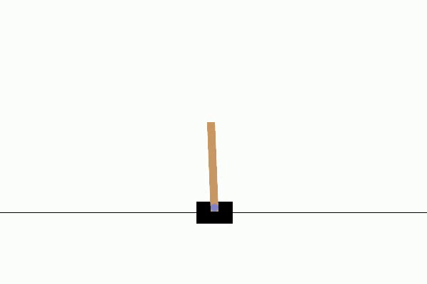
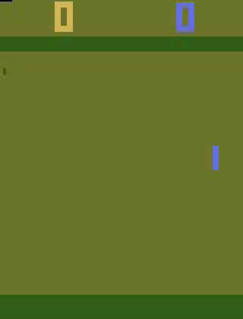
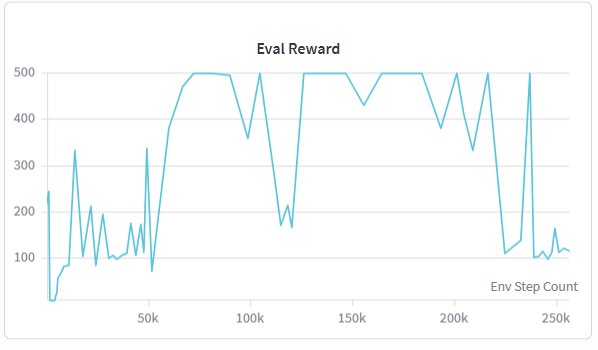
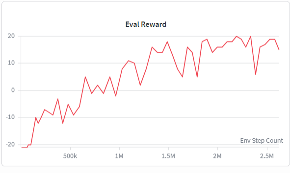
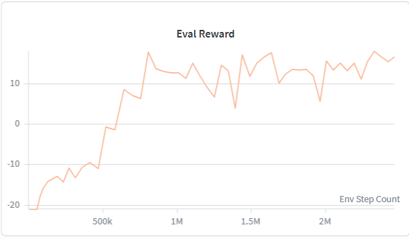

# Value-Based Deep Reinforcement Learning: DQN → Double DQN + PER + Multi-Step + Dueling

Implementation and systematic experimental analysis of Deep Q-Network (DQN) and its major extensions, evaluated on `CartPole-v1` and Atari `Pong-v5`. Built for the **Deep Learning (535518)** course at **National Yang Ming Chiao Tung University (NYCU)**, taken as a cross-institution enrollment student from **National Cheng Kung University (NCKU)**.

<p align="center">
  
  &nbsp;&nbsp;
  
</p>
<p align="center"><sub>Left: Task 1 agent (<code>checkpoints/LAB5_H24111269_task1.pt</code>) balancing CartPole-v1 to the max episode length. Right: Task 3 Enhanced DQN agent (<code>checkpoints/LAB5_H24111269_task3_best.pt</code>, green paddle) rallying against the built-in Pong-v5 opponent — Task 2's vanilla DQN plays the same environment, so only the stronger Task 3 agent is shown here.</sub></p>

> 中文摘要:本專案實作 DQN 及其進階變體(Double DQN、Prioritized Experience Replay、Multi-step Return、Dueling Architecture),並在 CartPole-v1 與 Atari Pong-v5 環境上進行系統性的樣本效率(sample efficiency)分析與消融實驗(ablation study)。完整方法說明與圖表請見 [`docs/LAB5_H24111269_report.pdf`](docs/LAB5_H24111269_report.pdf)。

## Highlights

| Task | Environment | Method | Best Result |
|---|---|---|---|
| Task 1 | `CartPole-v1` | Vanilla DQN (MLP) | **500.0 / 500** avg. reward over 20 episodes |
| Task 2 | `ALE/Pong-v5` | Vanilla DQN (CNN, raw pixels) | **15.80** avg. reward over 20 seeds |
| Task 3 | `ALE/Pong-v5` | Double DQN + PER + 3-step return + Dueling | **17.35** avg. reward, ~**1.5–2×** faster mid-training convergence than Task 2 |

- Full ablation study isolating the contribution of each of the four Task-3 enhancements.
- Custom CleanRL-style Atari wrapper stack (`NoOp` reset, frame skip + max-pool, episodic-life, fire-reset, reward clipping).
- Prioritized Experience Replay implemented from scratch (proportional priority, importance-sampling correction, annealed β).
- Milestone checkpointing every 500K env steps for reproducible sample-efficiency comparisons.
- Full experiment tracking via Weights & Biases (episode reward, greedy eval reward, TD loss, Q-value statistics, ε/β schedules).

## Repository Structure

```
.
├── src/
│   ├── dqn.py                # Task 1: Vanilla DQN on CartPole-v1 (MLP Q-network)
│   ├── atari_dqn.py          # Task 2: Vanilla DQN on Atari Pong-v5 (CNN Q-network)
│   ├── enhanced_dqn.py       # Task 3: Double DQN + PER + Multi-step + Dueling DQN
│   ├── test_model_task1.py   # Evaluation script for Task 1
│   ├── test_model_task2.py   # Evaluation script for Task 2
│   └── test_model_task3.py   # Evaluation script for Task 3
├── scripts/
│   ├── train_task1.sh        # Reference hyperparameters used for the reported results
│   ├── train_task2.sh
│   ├── train_task3.sh
│   └── record_demo.py        # Renders a greedy rollout GIF from a trained checkpoint
├── checkpoints/
│   ├── LAB5_H24111269_task1.pt        # Task 1 best model (500/500)
│   ├── LAB5_H24111269_task2.pt        # Task 2 best model (15.80)
│   └── LAB5_H24111269_task3_best.pt   # Task 3 best model (17.35)
├── assets/                   # Training-curve plots and demo GIFs used in this README
├── docs/
│   └── LAB5_H24111269_report.pdf      # Full lab report: derivations, training curves, ablations
└── requirements.txt
```

Intermediate milestone checkpoints (600K / 1M / 1.5M / 2M / 2.5M env steps) are omitted to keep the repository lightweight; they can be regenerated with `scripts/train_task3.sh` (milestones are saved automatically, see `enhanced_dqn.py`).

## Method

**Task 1 — Vanilla DQN (`src/dqn.py`)**
A 2-hidden-layer MLP (64-64) Q-network trained with a standard replay buffer, ε-greedy exploration, and a periodically-synced target network on `CartPole-v1`.

**Task 2 — Vanilla DQN on Atari (`src/atari_dqn.py`)**
Pixel observations are converted to grayscale, resized to 84×84, and stacked across 4 frames. The Q-network follows the original DQN CNN architecture (Mnih et al., 2015): three convolutional layers followed by two fully-connected layers.

**Task 3 — Enhanced DQN (`src/enhanced_dqn.py`)**
Combines four independent improvements on top of Task 2's baseline:
- **Double DQN** — the online network selects the greedy action, the target network evaluates it, reducing the max-operator's overestimation bias.
- **Prioritized Experience Replay (PER)** — transitions are sampled proportionally to `(|TD-error| + ε)^α`, with importance-sampling weights `(N·p_i)^(-β)` (β annealed 0.4 → 1.0) to correct the sampling bias.
- **Multi-step Return (n = 3)** — the 1-step TD target is replaced by an n-step bootstrapped return, propagating reward signal further per update.
- **Dueling Architecture** — the Q-function is decomposed into a state-value stream `V(s)` and an advantage stream `A(s,a)`, improving estimation stability in states where action choice has little effect.
Also adopts the standard Atari preprocessing stack (no-op reset, frame-skip + max-pool over 4 frames, episodic-life termination, fire-on-reset, reward clipping) following the CleanRL / Nature DQN convention.

## Training Curves

Greedy evaluation reward vs. environment steps, logged via Weights & Biases (evaluated every 20 episodes).

| Task 1 — CartPole-v1 (Vanilla DQN) | Task 2 — Pong-v5 (Vanilla DQN) | Task 3 — Pong-v5 (Enhanced DQN) |
|:---:|:---:|:---:|
|  |  |  |
| Converges to a perfect 500/500 by ~75K steps, after `epsilon-decay` and buffer-size tuning. | Steady climb from −21 to ~15.8, plateauing after ~1.5M steps. | Reaches positive reward by ~600K steps and ~15 by 1M — visibly steeper than Task 2 over the same range. |

## Results

### Sample efficiency: Enhanced DQN (Task 3) vs. Vanilla DQN (Task 2), evaluated over 20 seeds

| Env. Steps | Enhanced DQN (Task 3) | Vanilla DQN (Task 2) |
|---|---|---|
| 600K | 0.55 | −7.50 |
| 1M | **11.55** | 7.95 |
| 1.5M | 14.30 | 10.80 |
| 2M | 16.05 | 12.75 |
| 2.5M | 16.95 | 15.80 |
| Best | **17.35** | 15.80 |

The enhanced agent reaches an average score of 11.55 at **1M** env steps — a level the vanilla baseline only reaches around **1.5–2M** steps, i.e. roughly **1.5–2× better mid-training sample efficiency**.

### Ablation study (Task 3, best evaluation reward)

| Configuration | Double DQN | PER | 3-step | Dueling | Best Eval Reward |
|---|:---:|:---:|:---:|:---:|---:|
| Vanilla DQN | | | | | 15.80 |
| + Double DQN | ✔ | | | | 16.60 |
| + PER | | ✔ | | | 15.25 |
| + 3-step | | | ✔ | | 16.95 |
| **Full Task 3** | ✔ | ✔ | ✔ | ✔ | **17.35** |

The full combination outperforms any single enhancement in isolation — Double DQN and Dueling primarily raise the performance ceiling and stability, while PER and multi-step returns drive the mid-training acceleration.

## Key Findings

1. **ε-decay schedule is a first-order hyperparameter.** Too fast → premature convergence to a local optimum (exploration ends before a good policy is found); too slow → the agent fails to consistently exploit what it has learned. On CartPole, moving from `epsilon-decay=0.995` to `0.999` (with buffer size 50K, target update every 1000 steps) was the difference between an unstable policy and a perfect 500/500 score.
2. **Double DQN and PER are complementary, not redundant.** Double DQN reduces the variance/bias of the TD target itself, while PER changes *which* transitions are replayed most often — together they compound rather than overlap.
3. **`train_per_step` trades early speed for late-stage stability.** `train_per_step=2` learns faster early on but overfits to a still-immature replay buffer and burns through ε-decay twice as fast, hurting late-training performance relative to `train_per_step=1`. A staged schedule (2 → 1 → 0.5 across training) is proposed as future work — see the full report for details.

## Reproducing the Results

```bash
pip install -r requirements.txt

# Train (reference hyperparameters used for the reported results)
bash scripts/train_task1.sh   # CartPole-v1, Vanilla DQN
bash scripts/train_task2.sh   # Pong-v5, Vanilla DQN (CNN)
bash scripts/train_task3.sh   # Pong-v5, Double DQN + PER + Multi-step + Dueling

# Evaluate a checkpoint (20 episodes / seeds, deterministic greedy policy)
cd src
python test_model_task1.py --model_path ../checkpoints/LAB5_H24111269_task1.pt
python test_model_task2.py --model_path ../checkpoints/LAB5_H24111269_task2.pt
python test_model_task3.py --model_path ../checkpoints/LAB5_H24111269_task3_best.pt
cd ..

# Render a Pong gameplay GIF from a checkpoint (auto-picks the highest-scoring window of an episode)
python scripts/record_demo.py --seed 0
```

The `pong_demo.gif` and `cartpole_demo.gif` shown above are screen recordings of the actual trained agents (clipped with ezgif); `scripts/record_demo.py` is provided to render an equivalent Pong clip programmatically from any checkpoint.

Training was logged with [Weights & Biases](https://wandb.ai); pass `--wandb-run-name <name>` to any training script to tag a run, or set `WANDB_MODE=disabled` to run offline.

## Environment

- Python 3.10
- PyTorch ≥ 2.0, Gymnasium 1.1.1, `ale-py` ≥ 0.10.0 (Arcade Learning Environment / Stella)
- Full list in [`requirements.txt`](requirements.txt)

## Acknowledgements

Course starter code (environment wrappers scaffolding, script interfaces, assignment specification) provided by the **NYCU Deep Learning (535518)** teaching team — contributors Kai-Siang Ma and Alison Wen, instructor Prof. Ping-Chun Hsieh. All model implementations (`DQN`/`DuelingDQN` networks, Double DQN target computation, Prioritized Experience Replay, multi-step return logic, training/evaluation loops) and the experimental analysis in [`docs/LAB5_H24111269_report.pdf`](docs/LAB5_H24111269_report.pdf) are the author's own work.

## Author

**Kai-Ting Yan (顏愷廷)**, H24111269 — NCKU student, cross-enrolled in NYCU's Deep Learning course.
